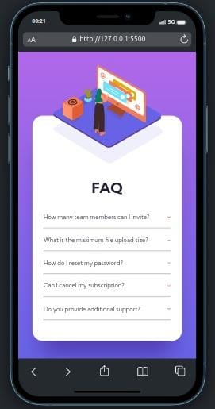

# FAQ Accordion Card

É um acordeão de perguntas frequentes. Este é um padrão de front-end extremamente comum.

## Tecnologias Utilizadas

- HTML
- CSS
- JavaScript
- Abordagem Mobile-first
- Responsividade

## Como Usar

1. Clone o repositório
2. Execute o projeto clicando no arquivo index.html ou abrindo pelo `Go live` do VsCode

## Layout e Design

Link Deploy: https://willianamorim.github.io/Cartao-Sanfona-FAQ/

## Como Contribuir

1. Clone o repositório
2. Faça as mudanças necessárias e crie um novo branch com o nome da sua funcionalidade
3. Envie um pull request

## Contato

Entre em contato comigo pelo `e-mail` willianamorim1@outlook.com.br ou pelo `LinkedIn` https://www.linkedin.com/in/willian-s-amorim/.